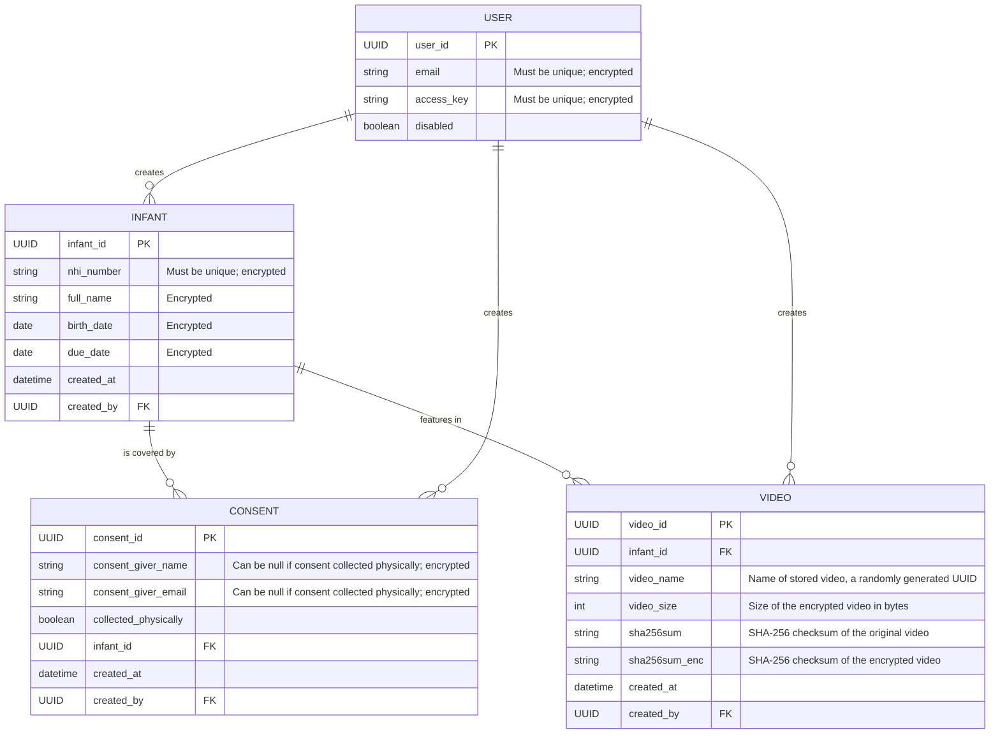

# Architecture

## Overview

The backend is written in Python using:

- the [FastAPI](https://fastapi.tiangolo.com/) framework
- [Pydantic](https://docs.pydantic.dev/latest/) and [SQLAlchemy](https://www.sqlalchemy.org/) (via [SQLModel](https://sqlmodel.tiangolo.com/))
- [click](https://click.palletsprojects.com/) for the command line interface
- [SQLite](https://www.sqlite.org/) database
- [pytest](https://docs.pytest.org/) for testing
- [mkdocs](https://www.mkdocs.org/) for documentation

Deployment is achieved using [Terraform](https://www.terraform.io/) and [Ansible](https://www.ansible.com/) to create and configure a VM on an OpenStack cloud ([NeSI RDC](https://support.cloud.nesi.org.nz/)). The TinyMotion backend software is containerised using docker and run using [Docker compose](https://docs.docker.com/compose/). [SWAG](https://docs.linuxserver.io/general/swag/) (secure web access gateway) is used in front of the API and handles generating SSL certificates.

## API

The API provides endpoints to authenticate, create an infant, create a consent and upload a video. There are no endpoints to retrieve information in the initial version of the API.

An infant must be created first. Once an infant has been created a consent must be created for that infant. The consent is linked to the infant by NHI number. Once a consent has been created, videos can be created for the infant. Videos are linked to an infant by NHI number. The API will return errors in the following cases (not exclusive, see also API docs TODO):

- a consent is added with an NHI number that does not match an infant in the database
- a video is added with an NHI number that does not match an infant in the database
- a video is added for an infant that has no consent recorded in the database

## Authentication

An access key is created for each user and shared with them. The access key is entered into the app and an API endpoint called to exchange the access key for access and refresh JWT tokens. The access token is passed in the Authorization header with subsequent API requests. If the access token expires, the refresh token can be used to generate a new access token. If the refresh token expires the access key must be entered again.

Initially, all users of the app will be treated the same (authorisation). All users will be able to upload (POST) information via the API. There are no API endpoints to retrieve information.

!!! note

    This approach to authentication was chosen as a compromise between security and ease of use for the early access users of the app.

## Administration

Administration (e.g. creating/updating users, accessing videos and information in the database) is done through SSH and a command line interface (IN PROGRESS). SSH to the VM is by public key only.

## Database

The initial version uses an SQLite database with the following structure:

Fields marked as encrypted are encrypted at rest using `StringEncryptedType` (symmetric encryption) from [SQLAlchemy-Utils](https://sqlalchemy-utils.readthedocs.io/en/latest/data_types.html) (IN PROGRESS).

Database backups can be achieved by copying the SQLite database file. Encrypted information in the backups will not be understandable without the secret key that was used to encrypt them.

!!! note
    
    SQLite should be sufficient while running at a small scale, and is good for speed of development, but could be worth considering switching to another database engine, such as PostgreSQL, when scaling up. This should be relatively simple as the database engine is abstracted away by SQLAlchemy.

## Video files

Video files are encrypted as they are received and written to disk on the VM in encrypted form only. Videos are encrypted using [Fernet](https://cryptography.io/en/latest/fernet/) (symmetric encryption, i.e. requiring the same secret key to decrypt them as was used to encrypt them). Encrypted video files are approximately 1/3 bigger than the unencrypted version would be. Video file names on disk are randomly generated UUIDs, these names are stored as *video_name* in the *VIDEO* table in the database.

Encrypted video files will be stored on object storage (TODO). Once they have been pushed to object storage they will be removed from VM disk.

## Secrets management

TODO
